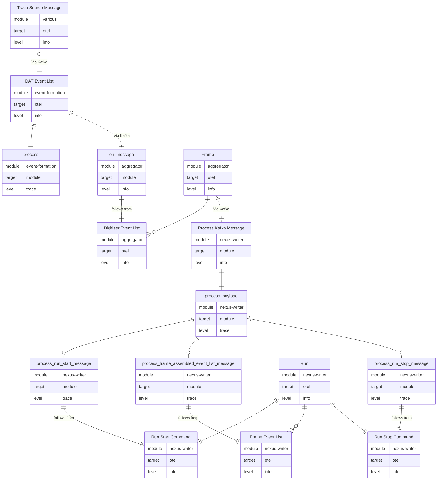

# Pipeline
The command to enter the dev shell is
```shell
nix develop ../supermusr-data-pipeline/
```

The command to run the Jaeger docker collector is
`docker compose --env-file ./configs/.env.hifi -f "./Docker/docker-compose.yaml" --profile=no-broker up -d`

The command to run the Jaeger docker all-in-one is
`docker compose --env-file ./configs/.env.hifi -f "./Docker/jaeger.yaml" --profile=all-in-one up -d`

To run the daq diagnostic tool run
`cargo run --bin diagnostics daq-trace --broker 130.246.55.29:9090 --topic daq-traces-in  --group vis-3`

